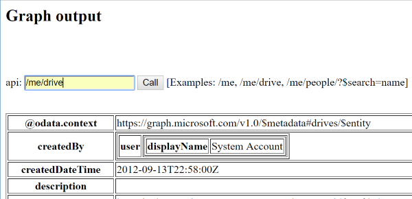

# Simple Microsoft Graph API connection tool

This code is derived from the (Microsoft Graph Python 3 Connect REST Sample)[https://github.com/microsoftgraph/python3-connect-rest-sample]. 

Like the Microsoft sample app, it is based on Python 3 and Flask, but the goal of this tool is to make the connection code as simple as possible, and to add links to manually explore a user's graph.

To run this code, the setup steps are the same as in the above example, except that instead of a _PRIVATE.txt file, it uses a file called graphconfig.json to store the application ID and application key.

