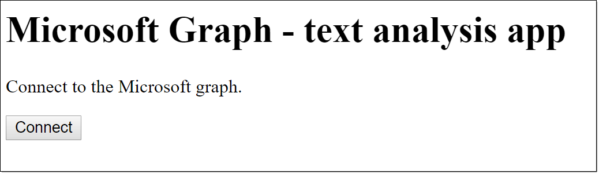
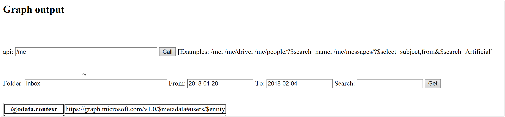
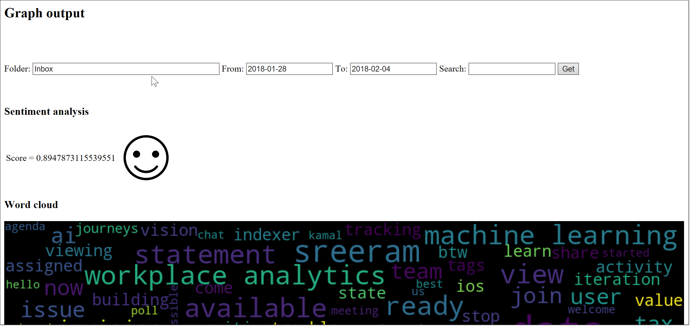

# Simple Microsoft Graph API WordCloud tool

This bottle app logs into the [Microsoft Graph](https://developer.microsoft.com/graph/) and does sentiment analysis/wordcloud/key phrase extraction on the selected mail folder for a date range and optional search term.

Sentiment analysis and key phrase extraction is done using the [Azure Cognitive Services](https://azure.microsoft.com/services/cognitive-services/) API. Wordcloud is done using the Python [WordCloud](https://pypi.python.org/pypi/wordcloud) library.

The Graph authentication using Bottle was inspired by the [Simple ADAL Bottle](https://github.com/microsoftgraph/python-sample-auth/blob/master/sample_adal_bottle.py) Microsoft Graph sample app.

If your mail volume is high, select a short date range (e.g. 1 week or less) or it will take too long (and presumably get throttled at some point). 

